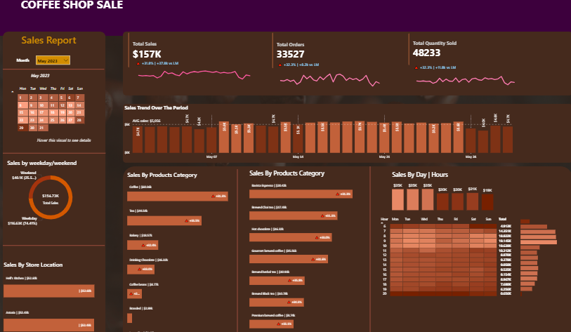

# Coffee_shop_sales_dashboard
Interactive Power BI dashboard analyzing Coffee Shop sales performance including KPIs, weekend vs weekday sales, product category insights, and store location analysis.
# ☕ Coffee Shop Sales Analysis – Power BI Project

## 📌 Project Overview

This project presents an interactive Power BI dashboard developed to analyze Coffee Shop sales data. The objective of this analysis is to evaluate overall business performance, identify sales trends, and generate actionable insights using data visualization and time intelligence functions.

The dashboard enables stakeholders to monitor key performance indicators (KPIs), compare monthly performance, and analyze sales across different product categories, store locations, and hourly trends.

---

## 📊 Key Performance Indicators (KPIs)

- Total Sales  
- Total Orders  
- Total Quantity Sold  
- Current Month Sales  
- Previous Month Sales  
- Month-over-Month (MoM) Growth %

---

## 📈 Dashboard Insights

- Sales comparison between Weekdays and Weekends  
- Sales performance by Store Location  
- Sales by Product Category and Product Type  
- Monthly Sales Trend Analysis  
- Hourly Sales Heatmap Analysis  
- Performance comparison using Conditional Formatting  

---

## 📐 Key DAX Measures & Logic Used

### 🔹 Total Sales

Revenue is calculated at transaction level using quantity and unit price.

```DAX
Total Sales =
SUMX(
    Transactions,
    Transactions[transaction_qty] * Transactions[unit_price]
)
```

---

### 🔹 Total Orders & Quantity

```DAX
Total Orders =
DISTINCTCOUNT(Transactions[transaction_id])

Total Quantity Sold =
SUM(Transactions[transaction_qty])
```

---

### 🔹 Current Month Sales (MTD Calculation)

Used TOTALMTD function to calculate month-to-date sales.

```DAX
Current Month Sales =
TOTALMTD(
    [Total Sales],
    'Date Table'[Date]
)
```

---

### 🔹 Previous Month Sales

DATEADD function is used to shift context to previous month.

```DAX
Previous Month Sales =
CALCULATE(
    [Current Month Sales],
    DATEADD('Date Table'[Date], -1, MONTH)
)
```

---

### 🔹 Month-over-Month (MoM) Growth %

Compares current month sales with previous month sales.

```DAX
MoM Growth % =
DIVIDE(
    [Current Month Sales] - [Previous Month Sales],
    [Previous Month Sales]
)
```

---

### 🔹 Conditional Formatting

Used IF logic to classify sales performance based on daily average sales.

```DAX
Daily AVG Sales =
AVERAGEX(
    ALLSELECTED(Transactions[transaction_date]),
    [Total Sales]
)

Colour for Bar =
IF(
    [Total Sales] > [Daily AVG Sales],
    "Above Average",
    "Below Average"
)
```

---

### 🔹 Dynamic Labels for Visuals

```DAX
Label for Store Location =
SELECTEDVALUE(Transactions[store_location])
& " | "
& FORMAT([Total Sales] / 1000, "$0.00k")
```

---

## 🛠️ Tools & Technologies Used

- Power BI  
- DAX (Data Analysis Expressions)  
- Data Modeling  
- Time Intelligence Functions  

---

## 💡 Business Insights

- Weekend sales show higher revenue compared to weekdays.  
- Certain product categories significantly contribute to total revenue.  
- Monthly comparison highlights growth trends and performance changes.  
- Hourly analysis helps identify peak business hours.  
- Conditional formatting enables quick performance comparison.

---

## 📷 Dashboard Preview



The dashboard provides a complete overview of sales performance, monthly comparison, category analysis,weekend, weekdays and hourly sales trends.
